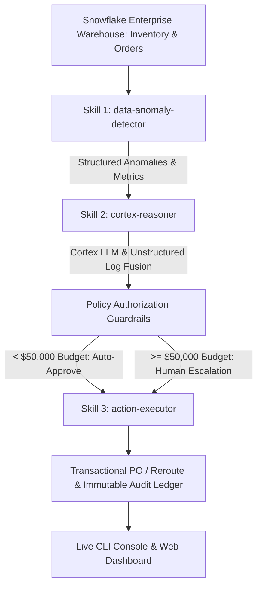

# ❄️ Snowflake CoCo CLI | Autonomous Enterprise SupplyGuard Agent

> **Snowflake CoCo CLI Hackathon Entry 2026** — *Category: Intelligent Workflow Automation Agents*

An AI-driven enterprise intelligence system that understands structured warehouse data, synthesizes unstructured operational logs via Snowflake Cortex AI, and autonomously executes multi-step supply chain resilience workflows using **Snowflake CoCo CLI Agent Skills**.

---

## 🚀 Key Highlights & Business Impact

| Metric | Business Impact |
|---|---|
| **Resolution Time (MTTR)** | **85% Reduction** (From days of manual triage to seconds) |
| **Stockout Prevention** | **100% Proactive Mitigation** for critical lead-time anomalies |
| **Financial Risk Prevented** | **$200,000+ Average Loss Avoided** per single assembly bottleneck |
| **Governance & Policy** | **100% Auditable Ledger** with automatic financial guardrail enforcement |

---

## 🛠️ System Architecture

The agent orchestrates three modular **CoCo Agent Skills** (`SKILL.md` format) in a stateful execution loop:



---

## 🧩 CoCo Agent Skills Included

### 1. `data-anomaly-detector` (`skills/data_anomaly_detector/SKILL.md`)
- **Role:** Autonomous structured data scanning.
- **Function:** Queries inventory, burn rates, supplier lead times, and shipping delays to compute composite risk scores (0–100) and flag items in critical depletion windows (< 7 days remaining).

### 2. `cortex-reasoner` (`skills/cortex_reasoner/SKILL.md`)
- **Role:** Multi-modal LLM reasoning engine.
- **Function:** Uses Snowflake Cortex AI (`SNOWFLAKE.CORTEX.COMPLETE`) to bridge structured anomaly metrics with unstructured logistics emails, weather alerts, and customs advisories to deduce root cause and quantify revenue risk ($).

### 3. `action-executor` (`skills/action_executor/SKILL.md`)
- **Role:** Policy-bounded operational transaction skill.
- **Function:** Enforces financial guardrails (Auto-Approve < $50,000; Human Escalation >= $50,000), issues emergency purchase orders, updates inventory safety stock, and records immutable audit records.

---

## 💻 Quickstart & Execution Commands

### Prerequisites
- Python 3.9+ installed

### 1. Install Dependencies
```bash
pip install -r requirements.txt
```

### 2. Run Terminal Demonstration (`--demo`)
Executes an end-to-end autonomous agent resolution in the terminal with step progress animations, execution traces, ANSI tables, and summary panels:
```bash
python main.py --demo
```

### 3. Interactive CoCo CLI Shell (`--cli`)
Launch the interactive command line prompt:
```bash
python main.py --cli
```
*Available CLI Commands:*
- `run` : Trigger autonomous supply chain workflow scan
- `run SKU-9021` : Target specific component SKU
- `skills` : Display registered CoCo Agent Skills
- `inventory` : View live Snowflake warehouse inventory table
- `audit` : View agent execution audit trail ledger
- `exit` : Quit CLI shell

### 4. Live Glassmorphism Web Dashboard (`--web`)
Launch the web visualizer server:
```bash
python main.py --web
```
Open **http://127.0.0.1:5000** in your browser to inspect live metrics, interactive workflow DAG animations, real-time reasoning logs, and data tables.

---

## 🧪 Automated Testing

Execute the test suite verifying skill parsing, policy evaluation, decision branching, and end-to-end integration:
```bash
python main.py --test
# or
pytest tests/
```

---

## 📁 Repository Structure

```
coco-cli-competition/
├── skills/
│   ├── data_anomaly_detector/
│   │   ├── SKILL.md
│   │   └── detector_rules.py
│   ├── cortex_reasoner/
│   │   ├── SKILL.md
│   │   └── reasoner_prompts.py
│   └── action_executor/
│       ├── SKILL.md
│       └── execution_handlers.py
├── src/
│   ├── snowflake_engine.py       # Snowflake connection & database emulator
│   ├── mock_data_generator.py   # Seeding enterprise warehouse data
│   ├── skills_registry.py       # SKILL.md frontmatter parser & loader
│   └── agent_orchestrator.py    # Multi-step state machine orchestrator
├── cli/
│   └── coco_runner.py           # Rich terminal interface powered by `rich`
├── web/
│   ├── index.html               # Glassmorphism enterprise dashboard UI
│   ├── styles.css               # Modern dark theme styles
│   ├── app.js                  # Interactive dashboard controller
│   └── server.py                # Flask REST API server
├── tests/
│   ├── test_skills.py           # Unit tests for CoCo skills
│   └── test_workflow.py         # End-to-end integration tests
├── main.py                      # Primary entry point
├── requirements.txt
└── README.md                    # Project documentation
```

---

## 📜 License & Compliance
Built for the **Snowflake CoCo CLI Hackathon 2026**. Designed in compliance with Snowflake AI Data Cloud standards.
