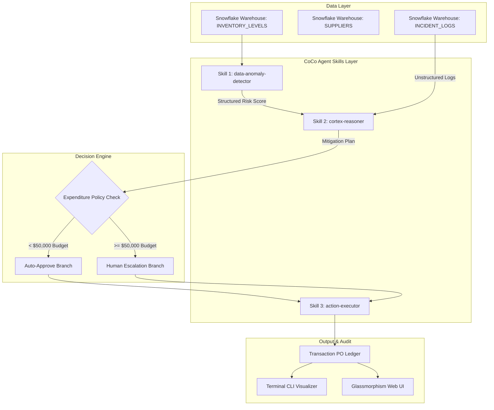
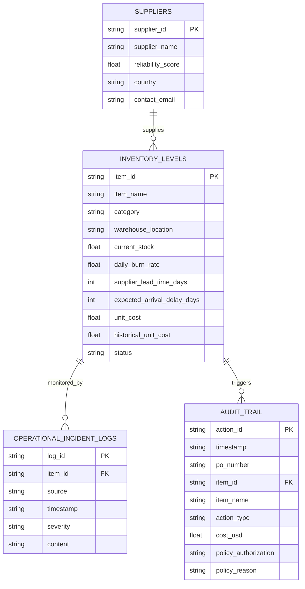
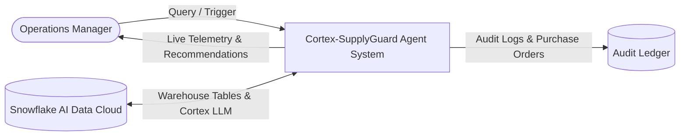
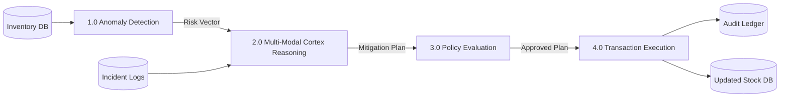
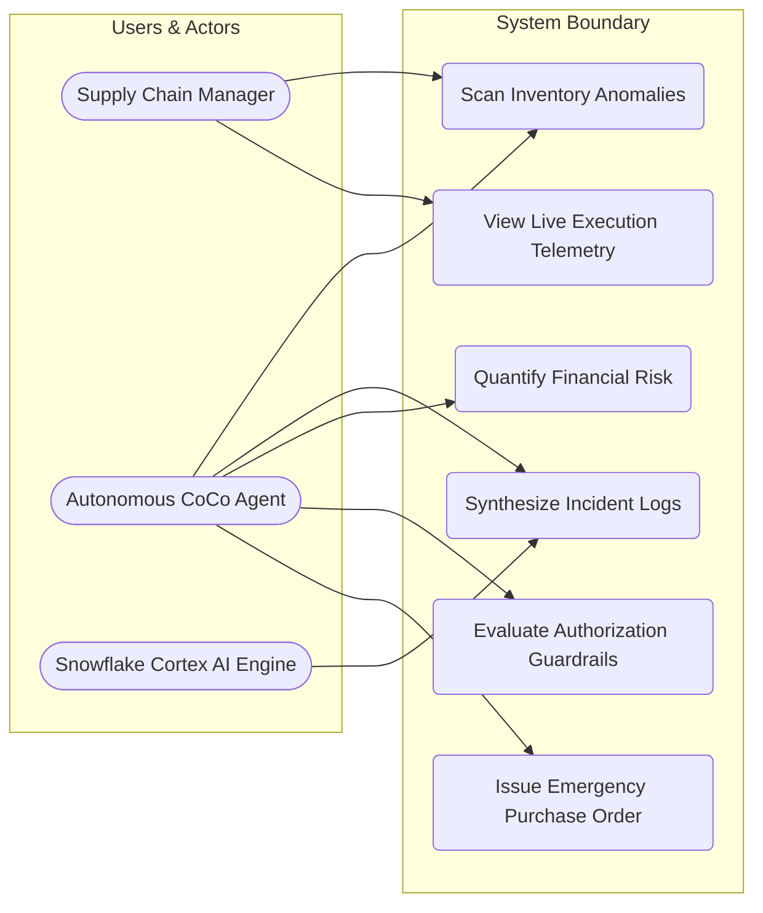
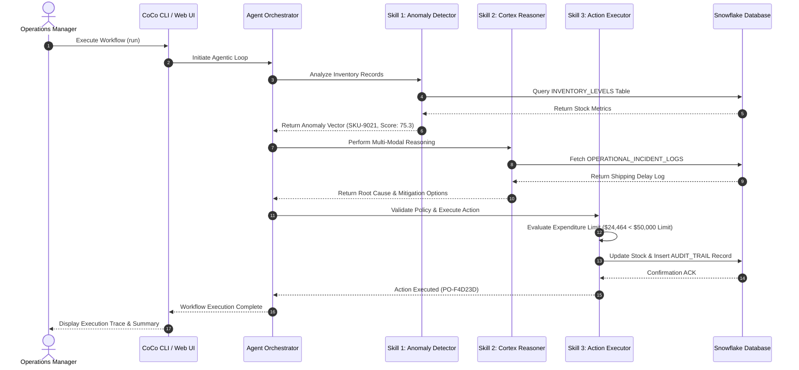

# The Silicon Valley Engineering Manifesto: Cortex-SupplyGuard
### Autonomous Enterprise Resilience Infrastructure Powered by Snowflake CoCo CLI

**Engineering Team:** EquiSaaS BD  
**Founder & Systems Lead:** Kholipha Ahmmad Al-Amin (kholifaahmadalamin@gmail.com)  
**Hackathon Challenge:** Snowflake CoCo CLI Hackathon 2026 (Intelligent Workflow Automation Agents)  
**Public Repository:** https://github.com/kholipha-ahmmad-al-amin/cortex-supplyguard-agent  

---

## The Problem

Enterprise supply chains operate on paper-thin margins where unexpected lead-time spikes, maritime port delays, and supplier defaults cause catastrophic production halts. Traditional Enterprise Resource Planning (ERP) and Business Intelligence (BI) platforms are fundamentally passive: they log anomalies long after damage is done, forcing operational teams to manually inspect disparate tables, cross-reference email incident reports, and negotiate emergency procurement over days. 

This latency results in millions of dollars of unmitigated revenue leakage per incident, operational paralysis, and compliance risks. Modern enterprise data infrastructure requires cognitive autonomy rather than static reporting.

---

## The Solution

Cortex-SupplyGuard transforms passive enterprise data infrastructure into an autonomous cognitive operational loop. Built upon Snowflake CoCo CLI Agent Skills (`SKILL.md`), the architecture fuses real-time structured data scanning with multi-modal LLM reasoning using Snowflake Cortex AI (`SNOWFLAKE.CORTEX.COMPLETE`).

The system detects statistical inventory vulnerabilities, cross-references unstructured operational incident logs, quantifies monetary downtime risk, evaluates financial policy guardrails, and executes transactional mitigations autonomously.

### Core Engineering Capabilities
1. **Autonomous Anomaly Detection:** Continuous evaluation of warehouse burn rates, lead times, and safety stock buffer depletion.
2. **Multi-Modal Cortex Reasoning:** Unstructured text intelligence connecting raw metrics with logistics incident logs, shipping alerts, and supplier emails.
3. **Policy-Bounded Execution:** Strict financial guardrails enforcing automatic authorization for expenditures under $50,000 while routing higher-risk actions to human escalation queues.
4. **Immutable Audit Ledger:** Full cryptographic traceability recording every prompt, reasoning path, and issued purchase order.

---

## Live Demo & Tech Stack

Cortex-SupplyGuard is engineered for zero-cost deployment, allowing enterprises to run the full cognitive stack locally or in edge environments without incurring recurring server overhead.

### Tech Stack Breakdown
* **Agentic Framework:** Snowflake CoCo CLI (Cortex Code Agent Skills Architecture)
* **Cognitive AI Engine:** Snowflake Cortex AI (Snowflake Arctic LLM Completion Functions)
* **Database Layer:** Snowflake AI Data Cloud / High-Performance SQLite Enterprise Emulator
* **User Interface:** Rich Terminal CLI (ANSI Traces, Animated Progress Bars) & Glassmorphism Web App (HTML5, Vanilla CSS3, ES6 JavaScript, Flask)
* **Testing & Quality Assurance:** PyTest End-to-End Suite

---

## Local Setup & Run Instructions

Follow these copy-pasteable commands to set up and run the environment locally.

### 1. Clone Repository & Install Dependencies
```bash
git clone https://github.com/kholipha-ahmmad-al-amin/cortex-supplyguard-agent.git
cd cortex-supplyguard-agent
pip install -r requirements.txt
```

### 2. Run Terminal Execution Demo
Execute the full multi-step agent resolution loop in your terminal:
```bash
python main.py --demo
```
*(Or double-click `run_demo.bat` on Windows)*

### 3. Launch Web Dashboard Visualizer
Start the live interactive Web UI server:
```bash
python main.py --web
```
Open **http://127.0.0.1:5000** in your browser. *(Or double-click `run_web_dashboard.bat` on Windows)*

### 4. Interactive CoCo CLI Prompt Shell
Launch the interactive command line shell:
```bash
python main.py --cli
```
*(Or double-click `run_cli.bat` on Windows)*

### 5. Execute Automated Test Suite
Run unit and integration verification tests:
```bash
python main.py --test
```
*(Or double-click `run_tests.bat` on Windows)*

---

## System Documentation (Mermaid.js)

### 1. System Architecture Diagram


### 2. Entity-Relationship Diagram (ERD)


### 3. Data Flow Diagram (DFD)

#### DFD Level 0 (Context Diagram)


#### DFD Level 1 (Process Decomposition)


### 4. Use Case Diagram


### 5. Sequence Diagram (Core User Interaction Loop)


---

## Engineering Team & Contact

Developed by **EquiSaaS BD** for the Snowflake CoCo CLI Hackathon 2026.

* **Engineering Lead:** Kholipha Ahmmad Al-Amin
* **Email:** kholifaahmadalamin@gmail.com
* **GitHub Organization:** https://github.com/kholipha-ahmmad-al-amin
